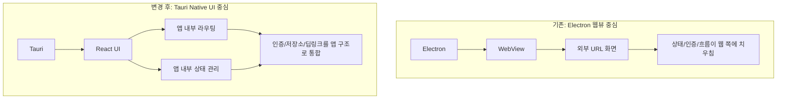
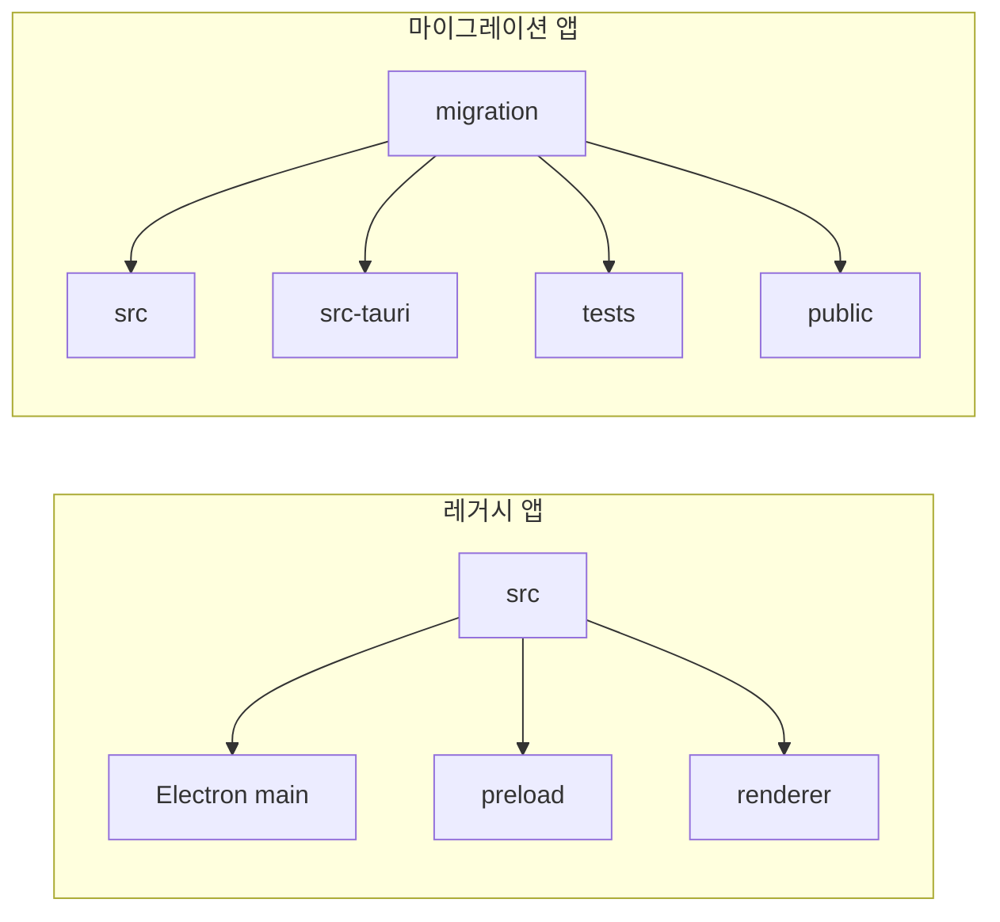
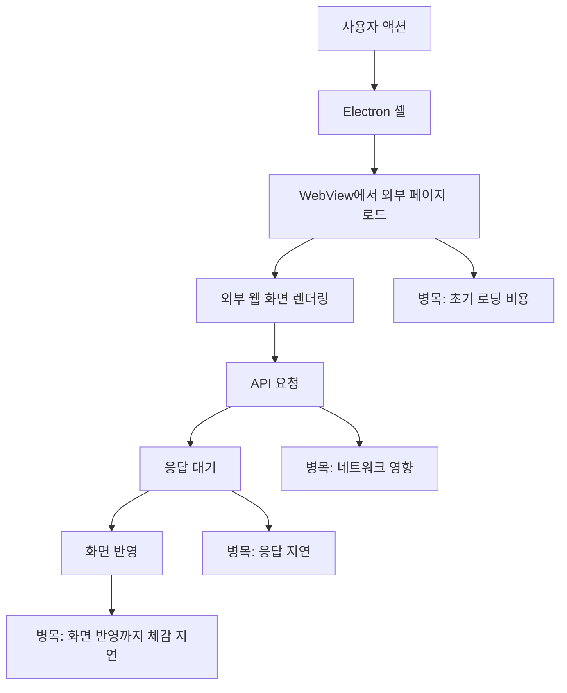
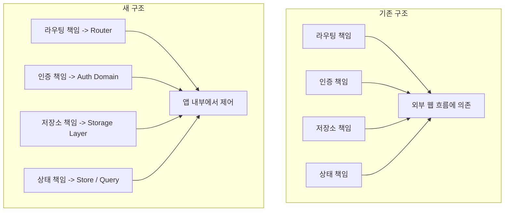

# Electron 웹뷰 앱을 Tauri Native UI로 마이그레이션하기 1: 왜 지금 갈아타는가

## 목차

1. 들어가며
   1. 애정이 가는 프로젝트라 더 제대로 손보고 싶었다.
   2. 실제 사용자 관점에서 불편한 지점이 분명히 보였다.
   3. 앱이 전반적으로 무겁게 느껴졌다.
2. 이 프로젝트는 무엇을 옮기는 작업인가
   1. Electron 웹뷰 앱을 Tauri 기반 Native UI 앱으로 옮기는 작업이다.
   2. 단순한 런타임 교체가 아니라 앱 구조를 다시 세우는 작업이다.
3. 왜 기존 Electron 웹뷰 구조를 계속 확장하지 않았는가
   1. Electron은 이번 목표에 비해 무겁다고 판단했다.
   2. 웹뷰 구조는 로딩과 응답성 측면에서 제약이 있었다.
   3. 네트워크 영향이 커서 앱 경험이 흔들리기 쉬웠다.
4. 왜 Tauri + React 기반 Native UI를 선택했는가
   1. 더 가볍고 빠른 데스크톱 앱 구조가 필요했다.
   2. Native UI 전환과 런타임 전환을 함께 가져가는 편이 맞다고 봤다.
5. 이번 마이그레이션에서 절대 바꾸지 않을 것
   1. 사용자가 익숙한 기본 UI 스타일은 유지한다.
6. 이번 마이그레이션에서 반드시 바꿔야 할 것
   1. 웹뷰 의존 구조를 화면 단위 UI 구조로 바꾼다.
   2. 상태, 인증, 라우팅을 앱 내부 구조로 재정리한다.
7. `src`와 `migration`을 어떤 기준으로 대응시킬 것인가
   1. 레거시를 먼저 분석하고 같은 역할의 단위로 대응시킨다.
   2. 개선이 필요한 부분은 확인 후 반영한다.
8. 이 시리즈를 어떤 순서로 풀어갈 것인가
   1. 레거시 분석
   2. 앱 골격 구성
   3. 인증과 상태 정리
   4. 화면 단위 마이그레이션
   5. 테스트와 회고
9. 마무리

## 들어가며

거부기린은 개인적으로 애정이 가는 프로젝트다. 그래서 더 대충 넘기고 싶지 않았다.

"지금도 돌아가니까 유지하자"는 식으로 남겨두기보다, 실제로 쓰는 사람이 덜 답답하고 앞으로 유지보수하는 사람도 덜 고생하는 구조로 바꾸고 싶었다. 소프트웨어를 오래 운영하다 보면 초기에 가볍게 선택한 구조가 나중에는 로딩 속도, 화면 전환, 오류 대응, 테스트 난이도, 배포 리스크로 이어진다. 거부기린도 그런 시점에 와 있다고 느꼈다.

특히 이 앱은 장난감 프로젝트가 아니라 실제 업무에 쓰이는 도구라는 점이 컸다. 개발자 입장에서는 "조금 느리지만 참을 수 있는 정도"라고 넘길 수 있어도, 사용자는 매일 반복되는 작은 지연과 어색한 동작을 더 예민하게 느낀다.

클릭했을 때 바로 반응하지 않거나, 화면이 잠깐 멈춘 것처럼 보이거나, 특정 흐름이 네트워크 상태에 따라 흔들리는 일은 몇 번만 겪어도 피로가 쌓인다. 거부기린을 계속 쓸 만한 도구로 남겨두려면, 이 지점을 더 이상 미뤄두기 어렵다고 봤다.

기존 `src` 폴더에는 URL 기반 웹뷰를 띄우는 Electron 앱이 있고, 새로 만드는 `migration` 폴더에는 Tauri + React로 구성한 Native UI 앱이 들어간다. 겉으로 보면 런타임 교체처럼 보이지만 실제로는 그보다 범위가 크다.

레거시 화면과 흐름을 그대로 이해해야 하고, 웹뷰에 기대고 있던 구조를 화면 단위 컴포넌트와 상태 관리 구조로 다시 세워야 한다. 인증, 저장소, 라우팅 같은 중심축도 새 런타임에 맞게 정리해야 한다.

## 이 프로젝트는 무엇을 옮기는 작업인가

이번 작업은 `Electron + 웹뷰` 형태의 데스크톱 앱을 `Tauri + React` 기반의 Native UI 앱으로 옮기는 일이다. 다만 "옮긴다"는 표현만으로는 부족하다.

기존 화면을 그대로 복사해서 새 런타임에 얹는 수준으로 끝나는 일이 아니기 때문이다. 웹뷰 기반 앱과 Native UI 기반 앱은 겉으로 비슷해 보여도 중심이 되는 실행 방식이 다르다.

기존 구조에서 앱은 웹뷰를 통해 외부 URL을 감싸는 성격이 강하다. 앱 자체가 모든 것을 직접 렌더링하고 통제하는 구조라기보다, 외부에 존재하는 웹 흐름을 데스크톱 컨테이너 안에 가져오는 구조에 가깝다.

이 방식은 초기 진입 속도 면에서 꽤 실용적이다. 이미 존재하는 웹 시스템이 있고, 그것을 비교적 빠르게 데스크톱처럼 제공하고 싶을 때 유리하다. 하지만 시간이 지나고 요구사항이 늘어나면, 앱 내부에서 제어해야 할 것과 웹뷰 바깥에서 처리해야 할 것의 경계가 흐려지기 시작한다.

반면 새로 만들 `migration` 앱은 Tauri와 React를 기반으로 한다. 여기서 기대하는 변화는 단지 실행 파일이 가벼워지는 것만이 아니다.

라우팅, 화면 구성, 상태 전이, 사용자 입력, 인증 흐름, 저장소 사용, 테스트 전략을 앱 내부 모델로 다시 가져오는 것이 핵심이다. 거부기린을 웹뷰를 띄워주는 껍데기에서 벗어나게 하고, 앱 자체가 자기 구조를 갖도록 바꾸려는 작업에 가깝다.

이번 작업에는 세 가지 변화가 같이 들어 있다. 런타임이 Electron에서 Tauri로 바뀌고, UI를 그리는 방식이 URL 기반 웹뷰에서 React 컴포넌트 중심으로 옮겨간다. 동시에 상태와 화면 제어의 책임도 외부 웹 흐름 쪽에서 앱 내부로 넘어온다. 그래서 이 작업은 기술 이전보다는 구조를 다시 잡는 작업에 더 가깝다.

또 하나 덧붙이면, 이 프로젝트는 "새 앱을 아무 제약 없이 새로 만드는 작업"도 아니다. 이미 사용 중인 레거시 앱이 있고, 그 앱이 제공하던 경험을 최대한 유지해야 한다.

즉, 자유롭게 새 제품을 설계하는 일이 아니라, 현재 동작을 존중하면서 그 기반을 바꾸는 일이다. 그래서 더 어렵고, 그래서 거부기린의 현재 모습을 아는 사람이 기록을 남겨야 할 가치도 크다.

## 왜 기존 Electron 웹뷰 구조를 계속 확장하지 않았는가

Electron 자체를 부정적으로 보려는 의도는 없다. Electron은 웹 기술로 데스크톱 앱을 빠르게 만드는 데 강한 선택지다. 다만 어떤 기술이든 현재 프로젝트의 상태와 목표에 맞아야 한다. 이번 프로젝트에서는 Electron 웹뷰 구조를 계속 확장하는 방식이 점점 더 불편해졌다.

가장 먼저 체감한 건 무게감이었다. 여기서 말하는 무게감은 실행 파일 크기만 뜻하지 않는다. 앱을 띄울 때의 인상, 화면이 바뀔 때의 템포, 버튼을 눌렀을 때 반응이 돌아오는 느낌까지 포함한다.

거부기린을 실제로 쓰는 입장에서 보면, 앱이 조금만 버벅여도 그 인상이 오래 남는다. 사용자는 내부 구조를 모르기 때문에 체감되는 결과만으로 앱 전체를 판단한다.

그 다음으로는 웹뷰 중심 구조 자체의 한계가 있었다. 웹뷰는 결국 외부의 웹 리소스를 불러오고 그 위에 흐름을 올리는 형태이기 때문에, 앱 내부에서 세밀하게 제어하고 싶은 부분이 생길수록 답답해진다.

화면 전환을 더 자연스럽게 만들고 싶거나, 특정 사용자 상태에 따라 즉시 반응하는 UI를 구성하고 싶거나, 네이티브 앱다운 상호작용을 넣고 싶을 때 웹뷰는 생각보다 큰 제약으로 돌아온다. 초기에는 "이 정도면 충분하다"고 느꼈던 설계가, 시간이 지나면서 점점 경계선이 보이기 시작한 셈이다.

네트워크 의존성 문제도 컸다. 웹뷰가 외부 웹 시스템을 불러오는 이상, 네트워크 상태에 따라 사용자 경험이 흔들리는 구간이 생길 수밖에 없다. 물론 모든 앱이 어느 정도 네트워크를 쓴다. 다만 앱의 기본 동작과 화면 전개까지 네트워크 영향이 크게 느껴지는 구조는 데스크톱 앱으로서는 아쉬움이 남는다.

유지보수 관점에서도 부담이 커졌다. 웹뷰 중심 구조는 처음에는 빠르게 진입할 수 있지만, 시간이 지날수록 앱이 직접 책임지는 코드와 외부 웹 흐름이 섞이면서 변경 영향도를 읽기 어려워진다.

어떤 수정이 어디까지 번질지 예측하기 어려워지고, 테스트도 경계면에서 복잡해진다. 거부기린을 계속 손볼 생각이라면, 이 구조를 오래 끌고 가는 게 맞는지 다시 볼 수밖에 없었다.

그래서 이번에는 현재 구조를 조금씩 연장하는 방법보다, 이 시점에서 구조를 다시 세우는 쪽이 더 현실적이라고 봤다. 당장은 일이 커 보일 수 있어도, 나중에 더 큰 비용으로 돌아오기 전에 방향을 잡는 편이 낫다고 판단했다.

## 왜 Tauri + React 기반 Native UI를 선택했는가

새 구조를 고민하면서 가장 먼저 세운 기준은 단순했다. 더 가볍고, 더 빠르고, 앱 내부 제어권을 더 많이 가져올 수 있어야 한다. 이 기준에서 Tauri는 꽤 잘 맞는 선택지였다. 데스크톱 앱 형태를 유지하면서도 기존보다 더 가볍게 구성할 수 있고, 프런트엔드 레이어는 익숙한 방식으로 가져갈 수 있다는 점이 컸다.

특히 이번 전환은 UI 구현을 Native UI 방향으로 옮기려는 목적이 분명했다. 그렇다면 중간 단계에서 "웹뷰는 그대로 두고 런타임만 조정하는 방식"보다는, 아예 앱의 중심 구조를 새롭게 세우는 편이 낫다고 봤다.

어차피 화면 단위로 다시 쪼개고 상태와 흐름을 정리해야 한다면, 그 시점에 런타임 역시 앞으로 더 맞는 방향으로 가져가는 것이 자연스럽다. 거부기린을 오래 가져갈 생각이면, 이번 전환이 임시 봉합으로 끝나면 안 된다고 생각했다.

React를 고른 이유도 같은 맥락이다. 마이그레이션은 결국 큰 덩어리를 한 번에 옮기는 작업이 아니라, 화면과 흐름을 작은 단위로 다시 나누어 옮기는 작업이다.

이때 컴포넌트 기반 UI 구조는 강한 장점을 가진다. 화면을 분해하고, 공통 요소를 추출하고, 상태를 주입하고, 테스트 가능한 단위로 쪼개는 데 유리하기 때문이다. 특히 기존 웹뷰 기반 구조에서 앱 내부 구조로 전환할 때는 "지금 이 화면이 어떤 책임을 갖는가"를 분리해 보는 일이 중요한데, React는 그런 사고방식과 잘 맞는다.

현재 `migration` 앱의 뼈대도 그 방향으로 구성되어 있다. React Router 7은 앱 내부 라우팅 구조를 분명하게 세우는 데 도움이 되고, Zustand는 클라이언트 상태를 비교적 단순한 형태로 관리하는 데 적합하다.

TanStack Query는 서버 상태와 캐싱, 요청 흐름을 정리하는 데 유용하고, i18next는 다국어 처리에 대한 확장성을 준다. 여기에 Tauri 2 런타임과 플러그인을 조합하면, 데스크톱 앱으로서 필요한 진입 정보, 환경 연동, 플랫폼별 처리도 점차 앱 내부로 끌어올 수 있다.

중요한 건 이 조합이 유행하는 스택이라서 고른 게 아니라는 점이다. 이번 프로젝트에서는 이 조합으로 무엇을 더 쉽게 통제할 수 있는지가 더 중요했다. 화면 전환은 누가 책임지는지, 인증 상태는 어디서 읽고 쓰는지, 저장소는 어떻게 테스트 가능한 구조로 분리할지 같은 질문에 조금 더 명확하게 답할 수 있어야 했다.

또 하나 마음에 들었던 점은, 이 구조가 점진적 마이그레이션에도 잘 맞는다는 것이다. 기존 앱 전체를 한 번에 뒤집기보다, 도메인 단위로 차근차근 옮겨 갈 수 있어야 한다.

라우팅부터 세우고, 인증을 정리하고, 저장소를 안정화하고, 공통 UI를 다시 구성하고, 실제 화면 단위로 이식하는 흐름이 가능해야 했다. 거부기린처럼 이미 돌아가고 있는 앱은 한 번에 갈아엎는 방식보다 이런 순서가 훨씬 현실적이다.

## 이번 마이그레이션에서 절대 바꾸지 않을 것

이번 마이그레이션에서 가장 강하게 지키고 싶은 원칙은 UI 스타일을 바꾸지 않는 것이다. 이 작업은 리디자인 프로젝트가 아니다. 구조를 고치는 일과 디자인을 손보는 일은 분리해 두는 편이 낫다고 봤다.

사용자가 이미 익숙하게 사용하는 화면이라면, 그 익숙함 자체가 중요한 자산이다. 버튼의 위치, 정보가 배치되는 방식, 화면 흐름, 시선이 움직이는 순서, 테이블과 폼의 밀도감처럼 겉보기엔 사소해 보이는 요소들이 실제 작업 효율과 직결된다.

개발자나 디자이너 입장에서는 "이참에 좀 더 현대적으로 바꾸자"는 유혹이 생길 수 있다. 하지만 거부기린 같은 업무 도구는 새로운 멋보다 기존 숙련도를 유지하는 편이 더 중요할 때가 많다. 특히 마이그레이션 초기에는 그 원칙이 훨씬 중요하다.

UI 스타일을 바꾸지 않는다는 말은 색상이나 폰트만 유지한다는 뜻이 아니다. 정보의 위치 관계, 입력 순서, 화면이 열리고 닫히는 방식, 한 번에 보여주는 정보량, 익숙해진 상호작용 패턴까지 가능한 한 그대로 두겠다는 뜻에 가깝다.

이 원칙은 기술적으로도 중요하다. 마이그레이션 과정에서 UI 스타일까지 바꾸기 시작하면, 문제가 생겼을 때 원인을 분리하기가 어려워진다. 특정 동작이 이상한 것이 구조 전환 때문인지, 아니면 UI 배치가 달라졌기 때문인지 금방 판단하기 어려워진다. 테스트 범위도 넓어지고 검증 비용도 커진다. 결국 변경 원인이 섞이기 시작하면 전환 자체의 안정성이 떨어진다. 그래서 이번에는 의도적으로 "같은 화면을 다른 기반 위에 올린다"는 태도를 유지하려고 한다.

물론 구현 방식이 달라지면 아주 미세한 차이는 생길 수 있다. 픽셀 단위로 완전히 같게 만드는 것이 늘 현실적이지는 않다. 그래도 이번 단계의 목표는 사용자가 낯설어하지 않게 만드는 데 있다.

## 이번 마이그레이션에서 반드시 바꿔야 할 것

반대로 반드시 바꿔야 하는 것도 분명하다. 가장 먼저 바꿔야 하는 것은 웹뷰에 묶여 있는 구조다. 지금 필요한 건 기존 웹 화면을 새 껍데기에 보여주는 일이 아니라, 화면 하나하나를 앱 내부의 UI 단위로 다시 세우는 일이다. 앱이 어떤 화면을 언제 보여줄지, 어떤 상태에서 어떤 액션이 가능한지, 라우팅은 어떻게 이동하는지, 오류가 났을 때 어디서 복구할지를 앱 자체가 설명할 수 있어야 한다.

상태 구조도 중요하다. 웹뷰 중심 구조에서는 상태의 출처가 흐려지기 쉽다. 어떤 값은 외부 웹 페이지가 들고 있고, 어떤 값은 로컬 스토리지에 있고, 어떤 값은 앱이 임시로 알고 있고, 어떤 값은 URL이나 세션에 숨어 있을 수 있다. 당장은 돌아가더라도 시간이 지나면 디버깅 난이도가 빠르게 올라간다.

인증과 저장소는 특히 중요한 축이다. 브라우저 `localStorage` 기반 저장소, 백엔드 인증 API, Tauri 딥링크 진입 정보 같은 요소는 작은 세부 구현처럼 보이지만, 실제로는 앱의 신뢰성과 직결된다.

인증 상태를 어디에 저장하고 어떻게 복원할지, 앱 재시작 시 어떤 정보를 기준으로 세션을 판단할지, 딥링크로 진입했을 때 어떤 순서로 화면과 상태를 세팅할지 같은 문제는 마이그레이션에서 절대 뒤로 미루기 어렵다. 이 부분이 흔들리면 거부기린 전체 경험이 쉽게 불안정해진다.

테스트 가능성도 꼭 바꿔야 하는 대상이다. 레거시 구조에서는 동작이 실행 환경과 강하게 묶여 있어 확인이 어려웠다면, 새 구조에서는 적어도 핵심 도메인 로직만큼은 테스트 가능한 형태로 분리되어야 한다. 마이그레이션은 회귀 위험을 피할 수 없기 때문에, 새로 만드는 것만큼 같은 동작을 보장하는 일도 중요하다.

이번에 반드시 바꿔야 하는 것은 화려한 기능이 아니라 책임의 위치다. 화면 책임, 상태 책임, 인증 책임, 저장소 책임, 테스트 책임을 더 분명하게 나누는 쪽이 이번 마이그레이션의 핵심에 가깝다.

## `src`와 `migration`을 어떤 기준으로 대응시킬 것인가

이 프로젝트를 진행하면서 가장 경계하는 건 레거시를 충분히 읽기 전에 새 구조를 먼저 확정해 버리는 일이다. 새 기술을 보고 있으면 사람은 쉽게 "이 구조면 더 깔끔하겠다"는 생각을 하게 된다. 그런데 마이그레이션에서는 그 생각이 오히려 위험할 수 있다. 레거시 코드는 보기엔 낡아 보여도, 실제 사용 흐름과 제약, 예외 처리, 업무 상식이 응축된 결과물일 가능성이 크기 때문이다. 겉으로는 이상해 보여도, 실제로는 어떤 이유 때문에 그렇게 굳어진 경우가 많다.

그래서 `src`와 `migration`을 대응시킬 때는 먼저 "이 코드가 어떤 역할을 하고 있는가"를 읽는 것이 우선이다. 화면 하나를 보면 UI만 보는 게 아니라, 어떤 순서로 진입하는지, 어떤 조건에서 버튼이 활성화되는지, 어떤 데이터를 기준으로 분기하는지, 실패했을 때 어디로 돌아가는지까지 함께 읽어야 한다.

마이그레이션은 코드를 복사하는 작업이 아니라 책임을 옮기는 작업이기 때문에, 역할을 잘못 해석하면 아무리 코드가 깔끔해도 결과는 달라진다. 거부기린을 잘 안다고 생각할수록, 오히려 당연하게 여긴 흐름을 더 조심해서 읽어야 한다.

이 관점에서 보면 `src`와 `migration`은 파일 대 파일로 일대일 대응되는 관계가 아닐 수 있다. 기존에는 하나의 화면이나 하나의 웹뷰 흐름 안에 여러 책임이 뭉쳐 있었을 수 있다. 반면 신규 구조에서는 그것을 라우트, 페이지, 훅, 상태 저장소, API 계층, 테스트 유틸 같은 여러 단위로 분리하게 된다. 즉, 대응 기준은 파일명이나 폴더 구조가 아니라 "같은 책임을 어디에 두는가"가 되어야 한다.

동시에 개선 포인트를 보는 눈도 필요하다. 레거시를 있는 그대로 복제하기만 하면 기술 전환의 의미가 줄어든다. 하지만 그렇다고 개선 욕심이 앞서면 사용자 경험이 흔들릴 수 있다. 그래서 기준은 명확해야 한다. 사용자에게 보이는 핵심 경험은 유지하되, 내부 구조가 더 명확해지고 테스트 가능해지는 방향의 개선은 적극적으로 가져간다. 반대로 사용자 학습 비용을 갑자기 높이거나, 검증되지 않은 인터랙션으로 바꾸는 변화는 이번 단계에서 피한다.

`src`는 참고용 과거 코드가 아니라 해석의 출발점이고, `migration`은 단순한 복사본이 아니라 책임을 재배치한 새 구조다. 둘 사이를 연결하는 기준은 겉모양보다 역할이어야 한다.

## 이 시리즈를 어떤 순서로 풀어갈 것인가

이 시리즈는 한 편에서 모든 걸 설명하려 하지 않을 생각이다. 마이그레이션은 다뤄야 할 주제가 많고, 하나의 글에 다 밀어 넣으면 오히려 흐려진다. 첫 편인 이번 글은 왜 갈아타는지, 어떤 원칙으로 갈 것인지, 어디까지를 이번 전환의 범위로 볼 것인지를 적는 출발점이다.

그 다음 편에서는 레거시 `src` 구조를 어떻게 읽고 있는지 다룰 생각이다. 마이그레이션에서 가장 중요한 첫 단계는 사실 구현이 아니라 해석이다.

어떤 화면이 어떤 역할을 하고, 어디에 의존하고, 어떤 예외 흐름을 품고 있는지 제대로 읽지 못하면 이후 설계도 쉽게 흔들린다. 그래서 2편은 구현보다 분석에 집중할 가능성이 크다.

그 이후에는 `migration` 앱의 기본 골격을 설명하게 될 것이다. React Router 7로 라우팅을 어떻게 세우는지, Zustand와 TanStack Query의 역할을 어떻게 나누는지, 앱 전반의 초기 구조를 어떻게 가져가고 있는지 정리하고 싶다.

그 다음 축은 인증과 저장소다. 현재 프로젝트 맥락에서는 이 영역이 단순한 부속 기능이 아니라 앱의 중심에 가깝다.

`localStorage` 기반 저장소, 백엔드 인증 API, Tauri 딥링크 진입 정보, 테스트용 스토리지 분리 같은 주제는 실제로도 난도가 높고, 동시에 전환의 품질을 크게 좌우한다. 이 부분은 별도의 회차로 떼어 충분히 정리할 가치가 있다.

공통 UI와 레이아웃 설정도 뒤이어 다루게 될 것이다. 이번 전환의 중요한 원칙이 "UI 스타일은 바꾸지 않는다"인 만큼, 스타일을 유지하면서도 구현을 재사용 가능한 단위로 옮기는 과정 자체가 좋은 기록 거리가 된다.

어떤 요소는 그대로 복원해야 하고, 어떤 요소는 공통 컴포넌트로 승격할 수 있는지, 레이아웃 설정은 어떤 방식으로 정리해야 하는지를 한 번 별도로 적어두면 나중에도 큰 도움이 될 것 같다.

테스트 이야기도 빠질 수 없다. 마이그레이션은 새 기능 개발과 달리, 겉으로 같은 결과를 유지해야 한다는 압박이 크다. 그래서 테스트는 부가 작업이 아니라 핵심 작업에 가깝다.

Vitest 설정, 라우터 테스트 유틸, 스토리지 목킹, 특정 도메인 흐름의 검증 방법 같은 내용은 시리즈 후반에서 중요한 비중을 차지할 것 같다. 최종적으로는 실제 화면 하나를 선택해 레거시 분석부터 이식, 상태 연결, 테스트까지 전 과정을 보여주는 글도 쓰고 싶다. 그런 글이 있어야 추상적인 원칙이 실제 코드와 연결된다.

가능하면 각 글은 비슷한 형식을 유지할 예정이다. 문제 상황, 레거시에서 확인한 사실, 신규 구조에서의 설계 결정, 구현 포인트, 테스트 및 검증, 남은 과제 순으로 맞추면 읽는 흐름을 유지하기 쉽다.

## 마무리

이번 1편에서는 왜 이 마이그레이션을 시작했고, 어떤 원칙으로 진행할 것인지를 정리했다. 지금 구조를 계속 덧붙이는 방식보다, 사용자 경험의 겉모습은 유지하면서 앱 내부 구조를 다시 세우는 쪽이 더 맞다고 판단했다.

다음 글에서는 레거시 `src` 구조를 어떤 관점으로 읽고 있는지, 그리고 어떤 단위로 분해해야 거부기린을 새 앱 구조로 옮기기 쉬운지 더 구체적으로 적어보려고 한다.
