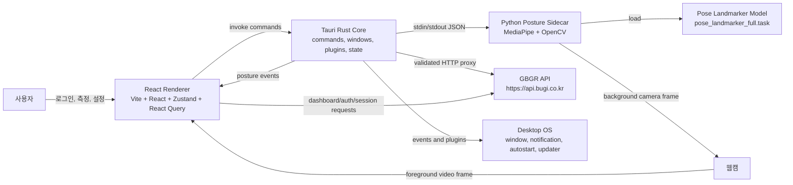
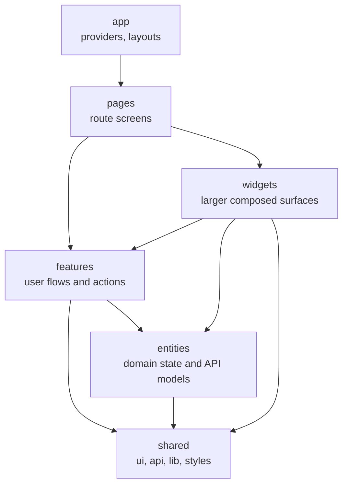
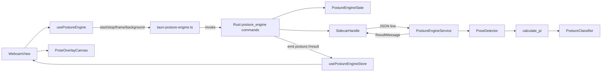
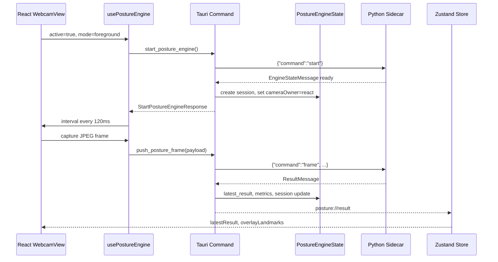
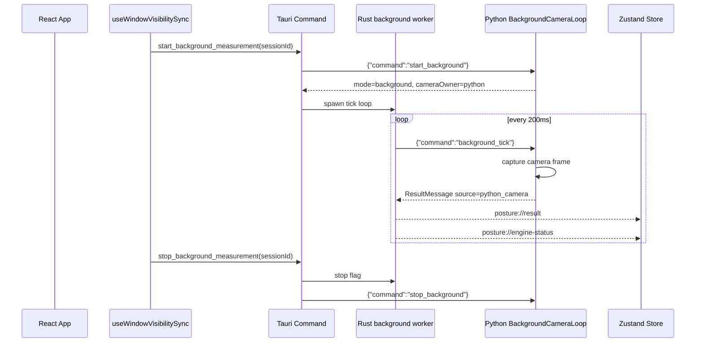
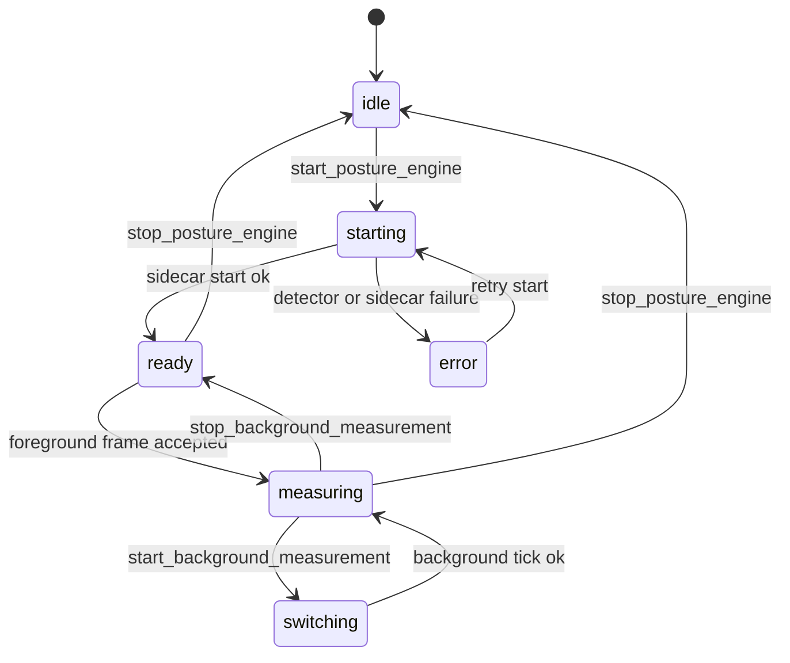
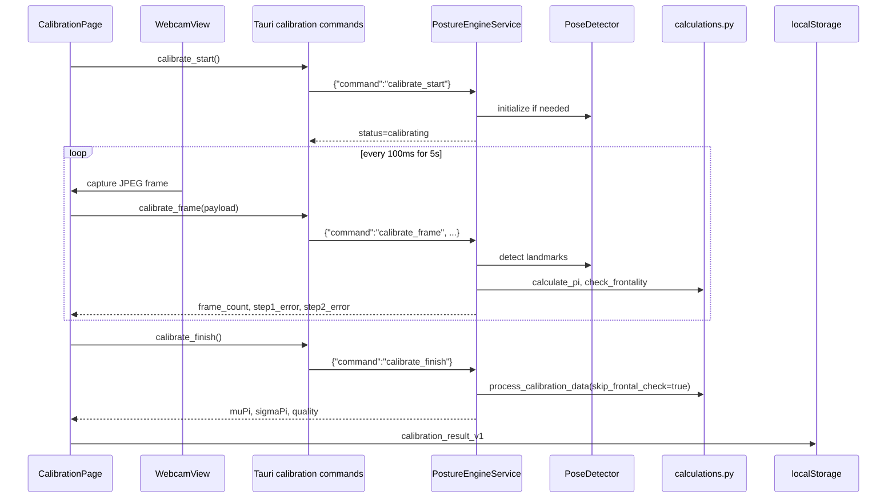
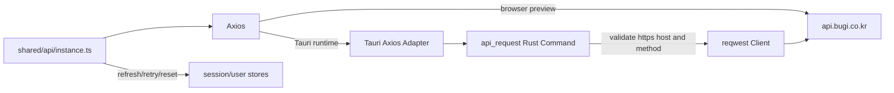
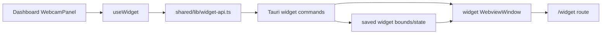

# 거부기린 Tauri 아키텍처 개요

작성일: 2026-05-19

## 목적

이 문서는 `gbgr-migration` 저장소의 현재 Tauri 마이그레이션 구조를 한눈에
파악하기 위한 아키텍처 지도입니다. 자세 추론 알고리즘 자체의 수식과 단계별
상세는 [posture-engine-pipeline.md](./posture-engine-pipeline.md)를 기준 문서로
두고, 여기서는 앱, Tauri 런타임, Python sidecar, 외부 API가 어떻게 연결되는지에
초점을 둡니다.

## 한 줄 요약

거부기린은 React 렌더러가 사용자 화면과 웹캠 프레임 캡처를 담당하고, Tauri
Rust 계층이 네이티브 창, 안전한 API 프록시, sidecar 프로세스, 이벤트 브리지를
담당하며, Python sidecar가 MediaPipe 기반 자세 분석과 캘리브레이션 계산을
수행하는 데스크톱 앱입니다.

## 시스템 컨텍스트



## 주요 런타임 경계

| 경계 | 파일 | 책임 |
| --- | --- | --- |
| React app shell | `migration/src/main.tsx`, `migration/src/shared/config/router.tsx` | 라우팅, provider, 페이지 진입 |
| Feature-sliced UI | `migration/src/{app,pages,widgets,features,entities,shared}` | 화면, 비즈니스 훅, 엔티티 상태, 공용 API |
| Tauri bootstrap | `migration/src-tauri/src/lib.rs` | 플러그인 등록, 상태 주입, 명령 등록, main/widget 창 생성 |
| API proxy | `migration/src/shared/api/instance.ts`, `migration/src-tauri/src/commands/api.rs` | 렌더러 API 요청을 Rust 명령으로 우회하고 허용 origin 검증 |
| Posture command bridge | `migration/src-tauri/src/commands/posture_engine/` | 자세 엔진 시작/중지, 프레임 전달, 캘리브레이션, 백그라운드 모드 |
| Posture runtime state | `migration/src-tauri/src/state/posture_engine_state/` | 세션, 최신 결과, 엔진 상태, 카메라 소유권, sidecar 핸들 |
| Sidecar process | `migration/src-tauri/src/posture_engine/sidecar.rs` | Python 또는 패키징된 binary sidecar 실행, JSON line RPC |
| Python engine | `sidecar/posture-engine/` | MediaPipe 추론, PI 계산, 점수화, 안정화, 캘리브레이션 |
| Widget window | `migration/src-tauri/src/widget/`, `migration/src/pages/widget-page/` | 보조 창 생성, 위치 저장, 표시/숨김 |

## 프런트엔드 구조

React 코드는 feature-sliced 구조를 따릅니다.



### 중요한 프런트엔드 흐름

- 인증은 `features/auth`, `entities/session`, `entities/user`가 나눠 갖습니다.
  `shared/api/instance.ts`는 Tauri 환경에서 Rust `api_request` 명령을 Axios
  adapter로 사용하고, 브라우저 미리보기에서는 일반 Axios 요청으로 동작합니다.
- `/main`은 `pages/main-page`에서 `pages/dashboard-page`로 위임됩니다. 이
  라우트에서 알림 스케줄러, 창 visibility 동기화, 측정 페이지 진입 analytics가
  붙습니다.
- 웹캠 측정 UI는 `features/main-panels/ui/WebcamPanel.tsx`와
  `pages/calibration-page/components/WebcamView.tsx`가 중심입니다.
- 자세 엔진 클라이언트는 `features/posture-engine/model/use-posture-engine.ts`가
  맡고, Tauri 명령 wrapper는 `features/posture-engine/lib/tauri-posture-engine.ts`
  에 모여 있습니다.
- 자세 결과 저장소는 `entities/posture/model/posture-engine-store.ts`의 Zustand
  store입니다. foreground 결과는 즉시 `latestResult`에 들어가고, background
  결과는 `restoredResult`에도 보존되어 웹캠이 꺼진 상태에서도 최근 자세 상태를
  유지합니다.

## 자세 측정 아키텍처



### Foreground 측정 시퀀스



### Background 측정 시퀀스



## 자세 엔진 상태 모델



이 상태는 Rust `PostureEngineState.engine_state`와 프런트엔드
`EngineStateEvent` 타입이 공유합니다. 카메라 소유권은 `react`, `python`, `none`
으로 표현되고, foreground는 React 웹캠이, background는 Python OpenCV 루프가
카메라를 소유합니다.

## 캘리브레이션 흐름



## Sidecar JSON contract

Rust와 Python sidecar는 stdin/stdout의 newline-delimited JSON으로 통신합니다.
`SidecarHandle::send_and_recv`는 한 명령을 쓰고 한 줄 응답을 기다립니다.

### 주요 명령

| 명령 | 호출 위치 | 응답 성격 |
| --- | --- | --- |
| `start` | `start_posture_engine` | `EngineStateMessage` |
| `frame` | `push_posture_frame` | `ResultMessage` |
| `start_background` | `start_background_measurement` | `EngineStateMessage` |
| `background_tick` | Rust background worker | `ResultMessage` |
| `stop_background` | `stop_background_measurement` | `EngineStateMessage` |
| `stop` | `stop_posture_engine` | `EngineStateMessage` |
| `calibrate_start` | `calibrate_start` | calibration status |
| `calibrate_frame` | `calibrate_frame` | frame count and guide errors |
| `calibrate_finish` | `calibrate_finish` | calibration stats |
| `set_calibration` | app startup restore | classifier calibration |

### ResultMessage

```json
{
  "result_id": "uuid",
  "session_id": "session-id",
  "timestamp": "unix-seconds",
  "posture_class": 3,
  "score": -0.287,
  "pi": -0.154,
  "landmarks": [{ "x": 0.5, "y": 0.2, "z": -0.1, "visibility": 0.99 }],
  "source": "react_frame",
  "engine_mode": "foreground",
  "events": ["enter_bad"]
}
```

## 외부 API와 인증



Rust의 `api_request`는 허용된 API origin만 통과시킵니다. 상대 경로는
`https://api.bugi.co.kr`에 붙이고, 절대 URL은 `https`, host, credential, port를
검증합니다. 이 구조는 Tauri WebView의 네트워크 제약과 보안 정책을 앱 내부
명령으로 통제하기 위한 계층입니다.

## Widget 창 구조



`ensure_widget_window`는 앱 setup 시 widget 창을 만들고 숨겨둡니다. 이후
`open_widget_window`, `close_widget_window`, `is_widget_open` 명령으로 표시 상태를
관리합니다. 창 위치와 크기는 widget 모듈의 state/bounds/events 계층에서 저장하고
복원합니다.

## 데이터 소유권

| 데이터 | 주 소유자 | 저장 위치 | 전달 방식 |
| --- | --- | --- | --- |
| 인증 토큰 | Frontend auth/session | `localStorage`, Zustand, Axios defaults | API 요청 header |
| 사용자 정보 | Frontend user entity | Zustand | `/users/me` |
| dashboard metrics | Remote API | React Query cache | REST API |
| 측정 세션 | Tauri posture state + frontend fallback | Rust `PostureEngineState`, frontend store | invoke response, event |
| 최신 자세 결과 | Tauri posture state | Rust mutex + Zustand | `posture://result` |
| 캘리브레이션 결과 | Frontend local storage + Python classifier runtime | `calibration_result_v1`, sidecar memory | `set_calibration` |
| camera owner | Tauri posture state | Rust + frontend derived ownership | `posture://engine-status` |
| widget bounds | Tauri widget module | app-local persisted state | window events |

## 패키징과 실행

- 개발 렌더러는 Vite입니다.
- 데스크톱 셸은 Tauri 2입니다.
- release 빌드는 Python sidecar를 별도 실행 파일로 패키징하는 스크립트를 거칩니다.
- debug 환경에서는 `GBGR_POSTURE_ENGINE_BIN`이 있으면 binary sidecar를 먼저 시도하고,
  실패하면 Python script sidecar로 fallback합니다.
- release 환경에서는 sidecar 환경변수 override를 막고, 패키징된 sidecar binary만
  허용합니다.
- updater는 Tauri updater 플러그인과 GitHub Releases `latest.json` 흐름을 사용합니다.

## 테스트 지도

| 영역 | 위치 | 커버하는 위험 |
| --- | --- | --- |
| React feature hooks | `migration/src/features/**/__tests__`, `*.test.ts(x)` | visibility sync, auth redirect, dashboard layout |
| Shared route gates | `migration/src/shared/lib/__tests__` | calibration gate, deep link, route guard |
| Rust posture state | `migration/src-tauri/src/posture_engine/tests/` | session recording, ownership transition, background mode |
| Rust API proxy | `migration/src-tauri/src/commands/api.rs` | URL allowlist, method allowlist |
| Python engine | `sidecar/posture-engine/tests/` | calculations, classifier, score processor, sidecar contract |

## 유지보수 포인트

- `sidecar/posture-engine/engine/pose_detector.py`는 MediaPipe 33개 랜드마크 중
  13개 키 랜드마크만 반환합니다. 프런트엔드 오버레이가 사용하는 인덱스는 이
  축약 배열 기준이므로 MediaPipe 원본 인덱스와 혼동하지 않아야 합니다.
- foreground/background 전환은 카메라 소유권 전환이 핵심입니다. React webcam
  stream을 멈추기 전에 Python background camera가 열리면 OS별 카메라 충돌이 날 수
  있습니다.
- `push_posture_frame`은 `frame_inflight`로 동시 프레임 처리 폭주를 막습니다.
  프레임 주기, sidecar timeout, 모델 성능을 함께 튜닝해야 합니다.
- 캘리브레이션 결과는 localStorage에 저장되고 앱 시작 시 `set_calibration`으로
  sidecar classifier에 복원됩니다. 앱 시작 직후 측정 전에 복원이 실패해도 치명
  오류로 처리하지 않습니다.
- Tauri API proxy는 현재 `api.bugi.co.kr`만 허용합니다. staging API나 로컬 API가
  필요하면 Rust allowlist 정책도 같이 바뀌어야 합니다.
- background 측정 알림은 `posture_class >= 4`일 때 발생합니다. 알림 빈도 조절은
  `notification_bridge`, `use-notification-scheduler`, metrics sender를 함께 봐야
  합니다.

## 빠른 탐색 경로

- 앱 시작점: `migration/src/main.tsx`
- 라우터: `migration/src/shared/config/router.tsx`
- 대시보드 진입: `migration/src/pages/main-page/index.tsx`
- 웹캠 패널: `migration/src/features/main-panels/ui/WebcamPanel.tsx`
- 웹캠 뷰와 오버레이: `migration/src/pages/calibration-page/components/WebcamView.tsx`
- 자세 엔진 훅: `migration/src/features/posture-engine/model/use-posture-engine.ts`
- Tauri 자세 명령 wrapper: `migration/src/features/posture-engine/lib/tauri-posture-engine.ts`
- Rust 자세 명령: `migration/src-tauri/src/commands/posture_engine/`
- Rust 자세 상태: `migration/src-tauri/src/state/posture_engine_state/`
- Rust sidecar bridge: `migration/src-tauri/src/posture_engine/sidecar.rs`
- Python sidecar service: `sidecar/posture-engine/main.py`
- Python detector/classifier: `sidecar/posture-engine/engine/`
