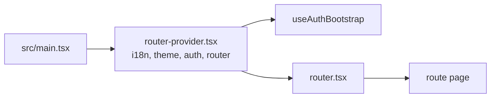
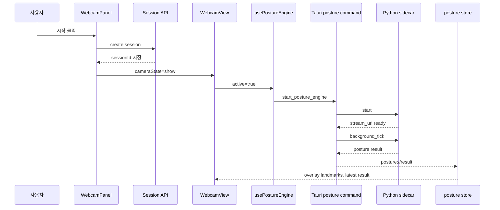
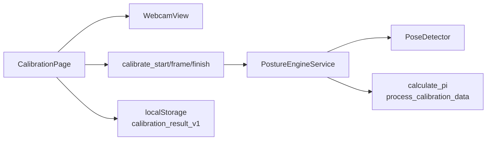

# 거부기린 개발 온보딩

작성일: 2026-05-19

## 먼저 읽는 순서

처음 보는 사람은 아래 순서로 보면 됩니다.

1. [migration/README.md](../README.md): 설치, 실행, 빌드 명령
2. 이 문서: 앱의 큰 흐름과 처음 봐야 할 파일
3. [architecture-overview.md](./architecture-overview.md): 전체 아키텍처와 다이어그램
4. [posture-engine-pipeline.md](./posture-engine-pipeline.md): 자세 추론 알고리즘 상세

## 이 앱은 뭐 하는 앱인가

거부기린은 웹캠으로 사용자의 자세를 측정하고, 자세가 나빠지면 대시보드와 위젯,
알림으로 피드백을 주는 데스크톱 앱입니다.

구조는 세 부분으로 나뉩니다.

- React renderer: 화면, 라우팅, 상태, 웹캠 프레임 캡처
- Tauri Rust core: 네이티브 창, Tauri command, API 프록시, sidecar 프로세스 관리
- Python posture sidecar: MediaPipe/OpenCV 기반 자세 추론, 캘리브레이션, 점수 계산

## 로컬에서 켜기

프런트엔드와 Tauri 명령은 `migration/`에서 실행합니다.

```bash
cd migration
pnpm install
pnpm run dev
```

데스크톱 앱으로 확인할 때는:

```bash
cd migration
pnpm run tauri:dev
```

자세 엔진까지 확인하려면 Python 3.11과
`sidecar/posture-engine/requirements.txt` 의존성이 필요합니다.

## 처음 30분에 볼 파일

| 목적 | 파일 |
| --- | --- |
| 앱 진입점 | `migration/src/main.tsx` |
| provider 구성 | `migration/src/app/providers/router-provider.tsx` |
| 라우팅 | `migration/src/shared/config/router.tsx` |
| 인증 초기화 | `migration/src/features/auth/model/use-auth-bootstrap.ts` |
| API 클라이언트 | `migration/src/shared/api/instance.ts` |
| Tauri API 프록시 | `migration/src-tauri/src/commands/api.rs` |
| 메인 페이지 진입 | `migration/src/pages/main-page/index.tsx` |
| 웹캠 패널 | `migration/src/features/main-panels/ui/WebcamPanel.tsx` |
| 웹캠 뷰 | `migration/src/pages/calibration-page/components/WebcamView.tsx` |
| 자세 엔진 훅 | `migration/src/features/posture-engine/model/use-posture-engine.ts` |
| 자세 엔진 Tauri wrapper | `migration/src/features/posture-engine/lib/tauri-posture-engine.ts` |
| 자세 엔진 store | `migration/src/entities/posture/model/posture-engine-store.ts` |
| Tauri 자세 명령 | `migration/src-tauri/src/commands/posture_engine/` |
| Tauri 자세 상태 | `migration/src-tauri/src/state/posture_engine_state/` |
| sidecar bridge | `migration/src-tauri/src/posture_engine/sidecar.rs` |
| Python sidecar main | `sidecar/posture-engine/main.py` |
| Python 자세 계산 | `sidecar/posture-engine/engine/` |

## 가장 중요한 사용자 흐름

### 카메라 권한과 로컬 엔진 준비

온보딩과 측정 진입은 두 단계를 모두 통과해야 합니다.

1. React renderer가 `navigator.mediaDevices.getUserMedia({ video: true, audio: false })`
   로 앱뷰 카메라 권한을 확인합니다.
2. 확인용 stream은 즉시 `track.stop()`으로 정리합니다.
3. Tauri `start_posture_engine` 명령이 Python sidecar를 시작하고, sidecar가
   OpenCV 카메라 루프와 로컬 MJPEG stream을 준비합니다.
4. `streamUrl`이 준비된 뒤에만 캘리브레이션/측정 화면으로 이동합니다.

이 흐름은 사용자에게 권한 요청 전 사용 목적과 로컬 처리 방식을 먼저 보여줍니다.
마이크 권한은 요청하지 않습니다. 권한 거부, 카메라 없음, 다른 앱의 카메라 점유,
프레임 읽기 실패는 각각 다른 복구 안내로 매핑됩니다.

### 앱 시작



앱은 `main.tsx`에서 시작하고, `router-provider.tsx`가 i18n, theme, auth, router를
묶습니다. 인증 상태는 `useAuthBootstrap`이 localStorage 토큰을 읽고 `/users/me`
로 복원합니다.

### 측정 시작 버튼



측정 시작은 서버 세션 생성과 로컬 자세 엔진 시작이 함께 움직입니다. 서버 세션은
대시보드/통계용이고, 로컬 자세 엔진은 실제 프레임 분석용입니다.

### 캘리브레이션



캘리브레이션은 5초 동안 약 100ms 간격으로 프레임을 보내고, Python sidecar가
`mu_PI`, `sigma_PI`를 계산합니다. 성공하면 `calibration_result_v1`에 저장하고,
측정 시작 시 `set_calibration`으로 sidecar에 복원합니다.

## 자주 헷갈리는 개념

### Tauri command

React에서 Rust 함수를 직접 호출하는 통로입니다. 프런트엔드에서는
`invoke('command_name')`처럼 호출하고, Rust에서는 `#[tauri::command]` 함수가
받습니다.

대표 예:

- `start_posture_engine`
- `start_background_measurement`
- `calibrate_frame`
- `api_request`
- `open_widget_window`

### Sidecar

Tauri 앱 옆에서 실행되는 별도 Python 프로세스입니다. Rust는 sidecar stdin에 JSON
한 줄을 쓰고, stdout에서 JSON 한 줄을 읽습니다. 이 구조 덕분에 React/Tauri 앱은
MediaPipe와 OpenCV 의존성을 직접 품지 않아도 됩니다.

### Foreground와 Background

foreground와 background 모드 모두 Python sidecar가 OpenCV로 카메라를 직접 잡고
프레임을 분석합니다. React는 token이 포함된 loopback `streamUrl`을 이미지로
렌더링하고, raw frame이나 카메라 장치 식별자를 저장하지 않습니다.

카메라 소유권은 이렇게 봅니다.

| 모드 | 카메라 소유자 | 프레임 소스 |
| --- | --- | --- |
| foreground | Python | OpenCV 캡처 + local MJPEG preview |
| background | Python | OpenCV `VideoCapture(0)` |
| idle | none | 없음 |

사용자가 카메라를 숨기면 measurement pause로 처리합니다. `WebcamPanel`은
`WebcamView`의 `isActive`를 즉시 `false`로 내리고, `usePostureEngine`은 sidecar
카메라 루프를 멈춰 새 frame 수집을 중단합니다. 다시 표시할 때는 로컬 엔진 준비를
재확인한 뒤 preview를 복구합니다.

### Posture result

자세 결과는 Python에서 `ResultMessage`로 만들어지고, Rust에서
`posture://result` 이벤트로 React에 전달됩니다. React store는 이 값을
`latestResult`로 저장하고, 웹캠 오버레이와 대시보드 패널이 사용합니다.

## 수정할 때 보는 곳

| 하고 싶은 일 | 주로 보는 파일 |
| --- | --- |
| 로그인/회원가입 고치기 | `features/auth`, `entities/session`, `shared/api/instance.ts` |
| 대시보드 데이터 고치기 | `entities/dashboard`, `features/main-panels` |
| 웹캠 화면 고치기 | `pages/calibration-page/components/WebcamView.tsx` |
| 오버레이 고치기 | `entities/posture/ui/PoseOverlayCanvas.tsx` |
| 측정 시작/중지 고치기 | `features/posture-engine/model/use-posture-engine.ts` |
| Rust 자세 명령 고치기 | `src-tauri/src/commands/posture_engine/` |
| sidecar 통신 고치기 | `src-tauri/src/posture_engine/sidecar.rs` |
| 자세 계산 고치기 | `sidecar/posture-engine/engine/calculations.py` |
| 분류 단계 고치기 | `sidecar/posture-engine/engine/posture_classifier.py` |
| 점수 smoothing 고치기 | `score_processor.py`, `posture_stabilizer.py` |
| 위젯 창 고치기 | `src-tauri/src/widget/`, `pages/widget-page/` |

## 변경 전 체크리스트

- 프런트엔드 타입 변경이면 `migration/src/entities/posture/model/posture-types.ts`와
  Rust `state/posture_engine_state/contracts.rs`가 같은 계약인지 확인합니다.
- sidecar 응답 필드를 바꾸면 Python `models/result.py`, Rust `parse_result`,
  TypeScript 타입을 같이 맞춥니다.
- 카메라 흐름을 바꾸면 foreground/background 소유권 전환을 같이 확인합니다.
- 캘리브레이션 계산을 바꾸면 `sidecar/posture-engine/tests/`에 Python 테스트를
  추가하거나 갱신합니다.
- Tauri API 프록시를 바꾸면 URL allowlist 보안 테스트를 유지합니다.

## 검증 명령

프런트엔드와 Tauri 앱:

```bash
cd migration
pnpm run lint:check
pnpm run typecheck
pnpm run test
pnpm run build
```

Python sidecar:

```bash
cd sidecar/posture-engine
pytest
```

## 더 깊게 볼 때

- 전체 아키텍처와 다이어그램:
  [architecture-overview.md](./architecture-overview.md)
- 자세 추론 알고리즘:
  [posture-engine-pipeline.md](./posture-engine-pipeline.md)
- 마이그레이션 기능 리뷰:
  [2026-05-08-functional-review.md](./2026-05-08-functional-review.md)
